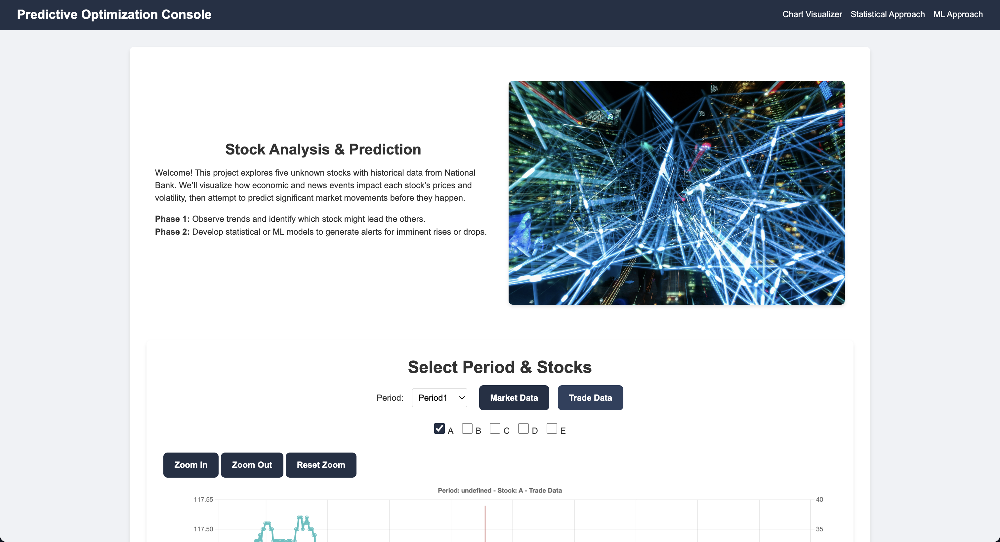
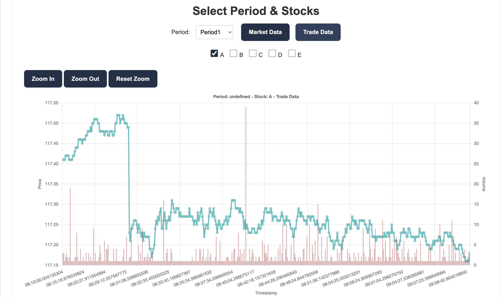
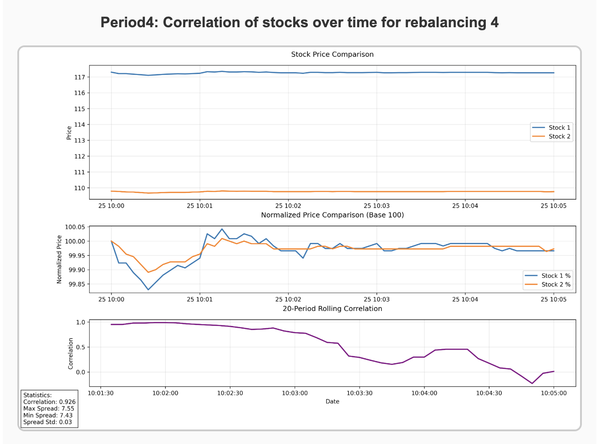
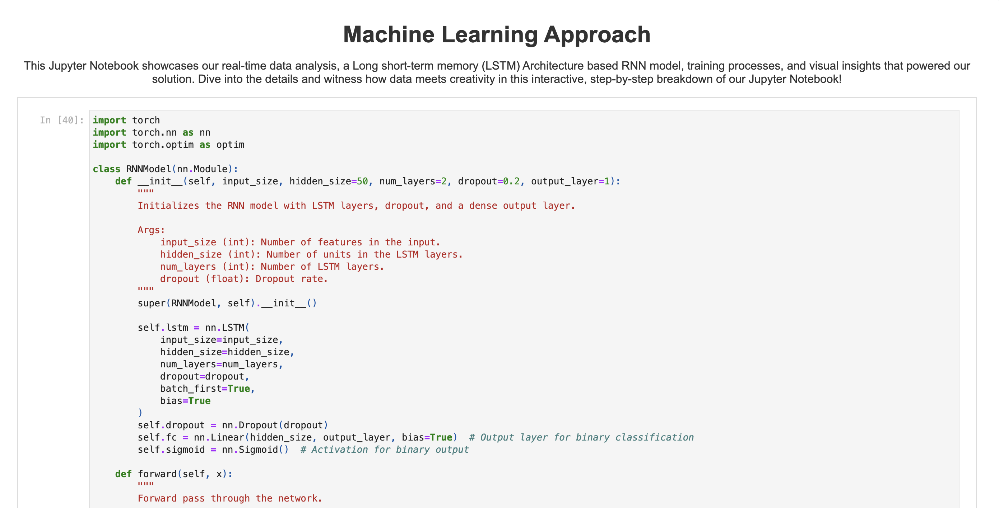

# Volatility Vision

## Overview

Volatility Vision is a high-frequency stock analysis tool designed to identify profitable buy-sell opportunities in micro timeframes. By combining advanced data visualization, a momentum-based pairs trading algorithm, and a recurrent neural network (RNN) model, our system provides insights into stock movements and assists traders in making informed decisions.

## Inspiration

Our team recently founded the Quantitative Research Club at McGill University, and we were inspired by the challenges and opportunities in high-volatility stock trading. We aimed to develop a robust tool that leverages quantitative methods to enhance trading strategies.

## Features

### Visual Stock Graphs

- Provides detailed visualizations of stock performance over multiple timeframes.
- Helps traders easily analyze trends and identify potential trading opportunities.

### Momentum-Based Pairs Trading Algorithm

- Executes pairs trading based on momentum.
- Rebalances correlated stock pairs every 5 minutes.
- Uses a 15-second interval (last 3 data points) to measure momentum and determine relative stock movement.
- Implements risk management parameters such as momentum and correlation thresholds.

### Recurrent Neural Network (RNN) Model

- Utilizes an LSTM-based architecture developed using PyTorch.
- Processes and cleans raw financial data for training.
- Achieves an 80-90% accuracy rate on both training and testing datasets provided by the National Bank.

## Technology Stack
- **Frontend**: React.js, Next.js
- **Backend & Algorithms**: Python, Pandas, Matplotlib
- **Machine Learning**: PyTorch, Jupyter Notebooks

## Challenges Faced
1. **Limited and Incomplete Data**: The dataset included only one hour of data for five stocks with missing points. We implemented specialized data preprocessing to handle these issues.
2. **Robust Backtesting**: Avoiding look-ahead bias was crucial. We ensured correct period separations for correlation calculations.
3. **Data Visualization**: Managing large datasets required structured labeling and consistency in naming conventions.
4. **RNN Fine-Tuning**: Iterative testing and optimization were needed to improve prediction accuracy.
5. **Risk Management**: Defined multiple parameters, including thresholds, cooldowns, and dynamic stop losses to enhance trading safety.

## Accomplishments
- **Advanced Visualizations**: Successfully identified stock correlations and patterns.
- **Effective Algorithms**: Demonstrated strong performance in both momentum-based trading and RNN-based predictions.

## Lessons Learned
- **Real-Time Data Handling**: Managing real-time stock data requires efficient processing methods.
- **Data Preprocessing**: Proper data preparation is key to improving algorithmic trading models.

## Future Plans
1. **Algorithm Optimization**: Testing the model on larger intervals to enhance performance.
2. **Expanded Trading Strategies**: Implementing long and short positions on correlated stock indexes.
3. **Research & Development**: Continuing to refine our methods, publish research papers, and stay updated on emerging trading strategies.
4. **Real-Time Trading Strategies**: Further developing live trading strategies to enhance accuracy and efficiency.

## Built With
- JavaScript
- Jupyter
- Matplotlib
- Next.js
- Pandas
- Python
- PyTorch
- React.js

